```r
knitr::opts_knit$set(root.dir = rprojroot::find_rstudio_root_file())
knitr::opts_chunk$set(cache=TRUE, cache.extra = R.version)
```


```r
suppressPackageStartupMessages({
  library(FactoMineR)
  library(factoextra)
  library(tidyverse)
  library(vcd)
  library(lattice)
  library(pins)
  library(synapser)
  library(data.table)
})
```

This analysis looks into genotype correspondence in AD-related loci across the three AMP-AD cohorts, and their enrichment across diagnosis, using Multiple Correspondence Analysis.

# Input
Loading metadata directly from synapse.  


```r
invisible(synLogin())
# All files from synapse are cached to /tier2/sdata/synapseCache

mayo <- read_csv(synGet("syn11384571")$path) %>%    
  select(wgs_id=WGS_Participant_ID, reported_apoe=ApoE, diagnosis=Diagnosis) %>%
  mutate(cohort="mayo", diagnosis=case_when(diagnosis=="PSP" ~ "Other",
                                            diagnosis=="Pathologic Aging" ~ "MCI",
                                            diagnosis=="AD" ~ "AD",
                                            diagnosis=="Control" ~ "Control"))

msbb <- read_tsv(synGet("syn11384608")$path) %>%
  filter(Action!="Exclude") %>%
  select(wgs_id=sampleIdentifier, individualID=individualIdentifier.inferred) %>%
  left_join(read_csv(synGet("syn6101474")$path), 
            by.y="individualID") %>%
  select(wgs_id, reported_apoe=apoeGenotype, diagnosis=CDR) %>%
  mutate(cohort="msbb", diagnosis=case_when(diagnosis %in% c(1:2) ~ "MCI",
                                            diagnosis %in% c(3:5) ~ "AD",
                                            diagnosis!=c(1:5) ~ "Control"))
  
rosmap <- read_csv(synGet("syn3382527")$path) %>%
  left_join(read_csv(synGet("syn3191087")$path), by="projid") %>%
  filter(!is.na(wgs_id)) %>%
  filter(!duplicated(wgs_id)) %>%
  select(wgs_id, reported_apoe=apoe_genotype, diagnosis=cogdx) %>%
  mutate(cohort="rosmap", diagnosis=case_when(diagnosis %in% c(2:3) ~ "MCI",
                                            diagnosis %in% c(4:5) ~ "AD",
                                            diagnosis==1 ~ "Control",
                                            diagnosis==6 ~ "Other"))

meta <- rbind(mayo, msbb, rosmap)
```

# Get variants positions
The first step is to extract variants position from the annotation files provided by AMP-AD.  
The list of variants is provided in ADvariants.txt. This file includes the closest AD-related gene for each variant based on the literature, as well as information related to its use for MODEL-AD, as given on [the MODEL-AD wiki page](https://www.synapse.org/#!Synapse:syn7419026/wiki/601516).


```r
invisible(synLogin())

variants <- read.delim("input/ADvariants.txt", header=TRUE, sep="\t", stringsAsFactors = FALSE) %>%
  select(ID, ClosestGene)

annofiles <- paste0("NIA_JG_1898_samples_GRM_WGS_b37_JointAnalysis01_2017-12-08_", 
                    1:22, 
                    ".recalibrated_variants.annotated.txt")
anno.all <- c()
for (fl in annofiles) {
  synid <- synFindEntityId(fl, parent="syn11707420")
  print(c(fl, synid))
  annot <- fread(file=synGet(synid)$path, sep="\t")
  vi <- which(annot$ID%in%variants$ID)
  anno.all <- rbind(anno.all, annot[vi,c("ID", "CHROM","POS", "REF","ALT")])
  rm(annot)
  }


anno.all %>%
  distinct() %>%
  merge(variants, by="ID", all=TRUE) %>%
  fwrite(file="output/ADvariants_anno.txt", 
         sep="\t", row.names = FALSE, quote = FALSE)
```

# Get genotypes
The second step extracts the genotypes in all the AD loci for all samples from the WGS vcf files. This is done on hpc.


```bash
qsub scripts/ADvariants_getGenotypes.pbs
```

# Re-coding genotypes
This step re-codes the genotype information extracted from the vcf files: 0, homozygote for the reference allele; 1, heterozygote; 2, homozygote for the alternative allele. For APOE it combines the two variants. These codes are treated as categorical below. The final genotype matrix is exported as [ADvariants_genotypes_all.csv](output/ADvariants_genotypes_all.csv) (see output section below).


```r
gtfiles <- list.files(path="output/", pattern="ADvariants_genotypes_rs")
variants <- read.delim(file="output/ADvariants_anno.txt", colClasses = "character")
genotypesL <- c()
  
for (fn in gtfiles) {
  gfile <- read.delim(file=paste0("output/",fn), header =FALSE, colClasses = "character")
  rsID <- gsub(pattern="ADvariants_genotypes_(rs\\d+).txt", "\\1", x=fn)
  g_rsid <- paste(variants$ClosestGene[variants$ID==rsID], rsID, sep="_")
  pos <- c(unique(gfile[,2]))
  gt <- gfile[gfile[,2]==pos,6] %>%
    recode("0/0"="0") %>%
    recode("0/1"="1") %>%
    recode("1/1"="2")
  genotypesL[[g_rsid]][[g_rsid]] <- gt
  genotypesL[[g_rsid]][["wgs_id"]] <- unique(as.character(gfile[,5]))
  }

genotypes <- as.data.frame(genotypesL[[1]], stringsAsFactors=FALSE)
for (l in 2:length(genotypesL)) {
  genotypes <- merge(genotypes, as.data.frame(genotypesL[[l]], stringsAsFactors=FALSE), by="wgs_id")
  }

genotypes <- filter(genotypes, wgs_id %in% meta$wgs_id)
# one sample has unknown genotype for TMEM106B_rs1054169 so "imputing" it with 0
genotypes$TMEM106B_rs1054169 <- recode(genotypes$TMEM106B_rs1054169, "./."="0") 
```

## APOE
Combining the genotypes for APOE variants rs429358 and rs7412.  
Comparing genotypes reported in the clinical files with the genotypes extracted here directly from the WGS data.  
A table listing all extracted and reported APOE genotypes is exported as  [APOE_all.csv](output/APOE_all.csv) (see output section below).

```r
apoe <- genotypes %>%
  select(wgs_id, rs429358=APOE_rs429358, rs7412=APOE_rs7412)

# combining the two variants
apoe$wgs_apoe <- NA
apoe$wgs_apoe[apoe$rs429358=="0" & apoe$rs7412=="2"] <- "22"
apoe$wgs_apoe[apoe$rs429358=="0" & apoe$rs7412=="1"] <- "23"
apoe$wgs_apoe[apoe$rs429358=="1" & apoe$rs7412=="1"] <- "24"
apoe$wgs_apoe[apoe$rs429358=="0" & apoe$rs7412=="0"] <- "33"
apoe$wgs_apoe[apoe$rs429358=="1" & apoe$rs7412=="0"] <- "34"
apoe$wgs_apoe[apoe$rs429358=="2" & apoe$rs7412=="0"] <- "44"

apoe <- merge(apoe, meta, by="wgs_id") %>% 
  select(-"diagnosis")
apoe$same_apoe <- if_else(apoe$reported_apoe == apoe$wgs_apoe, "YES", "NO")

cat("Mayo:", "\n",
    length(which(is.na(apoe$reported_apoe) & apoe$cohort=="mayo")), 
    "samples are missing ApoE genotype in clinical data", "\n",
    length(which(apoe$same_apoe=="NO" & apoe$cohort=="mayo")), 
    "samples differ in their reported and extracted ApoE genotype", "\n")
```

```
## Mayo: 
##  56 samples are missing ApoE genotype in clinical data 
##  0 samples differ in their reported and extracted ApoE genotype
```

```r
cat("MSBB:", "\n",
    length(which(is.na(apoe$reported_apoe) & apoe$cohort=="msbb")), 
    "samples are missing ApoE genotype in clinical data", "\n",
    length(which(apoe$same_apoe=="NO" & apoe$cohort=="msbb")), 
    "samples differ in their reported and extracted ApoE genotype", "\n")
```

```
## MSBB: 
##  136 samples are missing ApoE genotype in clinical data 
##  4 samples differ in their reported and extracted ApoE genotype
```

```r
cat("ROSMAP:", "\n",
    length(which(is.na(apoe$reported_apoe) & apoe$cohort=="rosmap")), 
    "samples are missing ApoE genotype in clinical data", "\n",
    length(which(apoe$same_apoe=="NO" & apoe$cohort=="rosmap")), 
    "samples differ in their reported and extracted ApoE genotype", "\n")
```

```
## ROSMAP: 
##  10 samples are missing ApoE genotype in clinical data 
##  21 samples differ in their reported and extracted ApoE genotype
```

```r
# removing the two separate variants in the genotypes table and replacing them with the combined genotype
genotypes <- genotypes %>%
  select(-starts_with("APOE"))
genotypes$APOE_e4 <- ifelse(apoe$wgs_apoe=="44", "2", ifelse(apoe$wgs_apoe=="22", "0", "1"))
```

# Distributions {.tabset .tabset-fade .tabset-pills}

```r
variants <- unique(colnames(genotypes)[-1])
data <- merge(genotypes, meta, by="wgs_id", all=FALSE) %>%
  select(-reported_apoe)

# removing rsIDs from var names for plots; modifying gene names that have more than one variant
varnm <- str_extract(variants, "^[^_]+")
dupi <- which(duplicated(varnm) | duplicated(varnm,fromLast = T))
cnx <- str_extract(variants[dupi], "\\d\\d$")
varnm[dupi] <- paste(varnm[dupi], cnx, sep="_")
names(varnm) <- variants
```
  
## Genotypes total frequencies
This graph is mostly to see if any of the genotypes have very low frequencies, which could bias the MCA.
IL34, SCIMP, APOE, ABCA7_50, and SHARPIN have low frequencies for genotype 2, and therefore should be deleted or pooled.  
Below I repeated the analysis with these genes pooled and unpooled.

```r
df <- data %>%
  pivot_longer(-c("wgs_id","diagnosis"),  names_to="variant", values_to = "genotype") %>%
  count(variant, genotype)

ggplot(df, aes( x = genotype, y = n) ) + 
      geom_bar( stat = "identity") + 
      facet_wrap( ~ variant ) + 
      geom_text( aes( label = n, y = n+1000 ),
                 vjust = 1.4, size = 3, color = "black" ) +
      theme_bw()
```

<!-- -->

```r
rm(df)
```

  
## Genotype frequencies by cohort
This graph is mostly to see if any of the categories have very low frequencies when split by cohort, which could bias the MCA.
IL34, SCIMP, ABCA7_rs3764650, SHARPIN, ADAMTS4, KLOTHO, and AP4E1/SPPL2A - pool genotypes 1+2  
ABCA7_rs3752246, HLA, PILRA - pool genotypes 0+1  
APOE4 needs to be reoved as it cannot be pooled  
Doesn't look like there's substantial difference between cohorts

```r
df <- data %>%
  pivot_longer(-c("wgs_id","diagnosis":"cohort"),  names_to="variant", values_to = "genotype") %>%
  count(cohort, variant, genotype)

ggplot(df, aes( x = cohort, y = n, fill=genotype) ) + 
      geom_bar( stat = "identity", position="dodge" ) + 
      facet_wrap( ~ variant ) + 
      theme_bw()+ 
      theme( axis.text.x = element_text( angle = 90,  hjust = 1 ) )
```

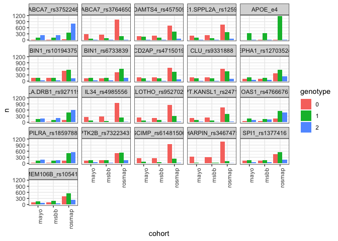<!-- -->

```r
rm(df)
```
  
## Chi2 deviations by cohort {.tabset .tabset-fade .tabset-pills}
Chi-square deviations of genotype by cohort are calculated for each variant independently.  
Deviations are mostly rather low, indicating no associations all in all.  
Only variants with very low frequencies (listed above) show any significant association with cohorts.
  
### Unpooled genotypes

```r
for (var in variants) {
  dfv <- data %>%
    select(gt=all_of(var), cohort) %>% 
    count(gt, cohort) %>%
    pivot_wider(names_from = gt, values_from = n) %>%
    column_to_rownames("cohort")
  
  assoc(as.matrix(dfv), main=var, shade=TRUE, 
        labeling_args = list(gp_labels = gpar(fontsize = 15), abbreviate_labs = c(6, 9), 
                             varnames=c(FALSE,FALSE), rot_labels=c(0,0)))
  }

rm(dfv)
```

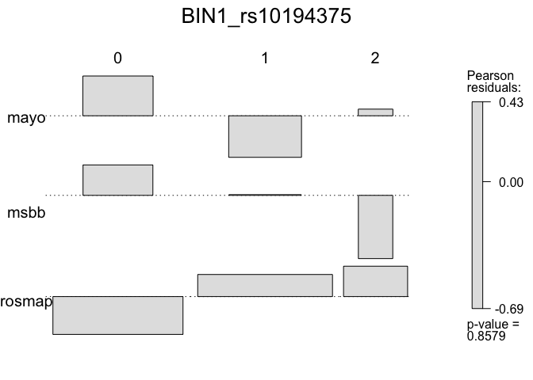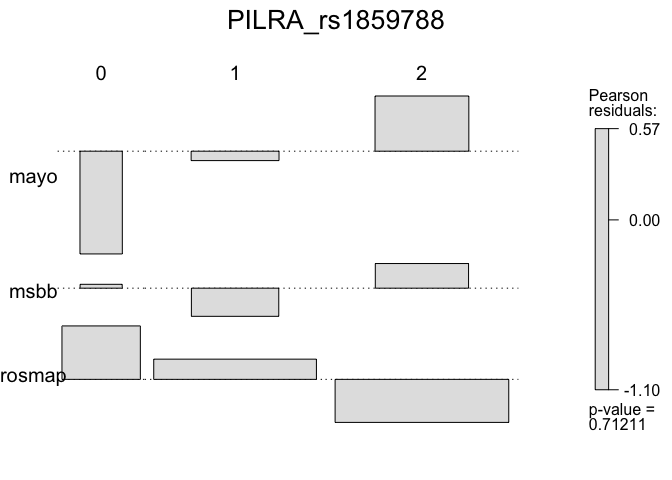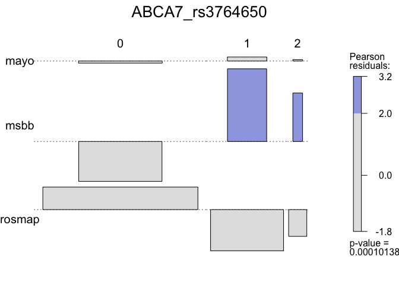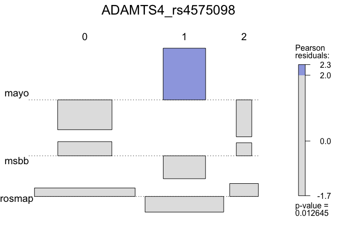
  
### Pooled genotypes

```r
pooled_12 <- c("ADAMTS4_rs4575098", "ABCA7_rs3764650", "AP4E1.SPPL2A_rs12595082", "IL34_rs4985556", "SCIMP_rs61481506", "SHARPIN_rs34674752", "KLOTHO_rs9527025")
pooled_01 <- c("ABCA7_rs3752246", "HLA.DRB1_rs9271192", "PILRA_rs1859788")

pooldata <- data %>%
  mutate_at(pooled_12, 
            function(x) {replace(x, which(x=="1" | x=="2"), "1+2")}) %>%
  mutate_at(pooled_01, 
            function(x) {replace(x, which(x=="0" | x=="1"), "0+1")})


for (var in variants) {
  dfv <- pooldata %>%
    select(gt=all_of(var), cohort) %>% 
    count(gt, cohort) %>%
    pivot_wider(names_from = gt, values_from = n) %>%
    column_to_rownames("cohort")
  
  assoc(as.matrix(dfv), main=var, shade=TRUE, 
        labeling_args = list(gp_labels = gpar(fontsize = 15), abbreviate_labs = c(6, 9), 
                             varnames=c(FALSE,FALSE), rot_labels=c(0,0)))
  }

rm(dfv)
```

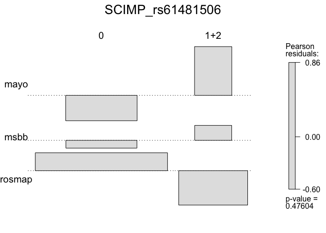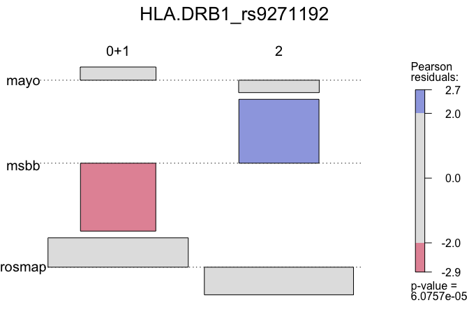

    
# Multiple Correspondence Analysis {.tabset .tabset-fade .tabset-pills}
This step explores the associations among variants and their enrichment in cohorts using Multiple Correspondence Analysis, as implemented in the MCA package http://www.sthda.com/english/articles/31-principal-component-methods-in-r-practical-guide/114-mca-multiple-correspondence-analysis-in-r-essentials/

The space is based on variants only and therefore represents co-occurrence among AD-related genotypes. 
Screeplot indicates that there isn't much structure in the data, i.e., variant genotypes do not co-occur in patients much more than expected by chance.  
The two variants of BIN1 and ABCA7 dominate the first and second axes, in orthogonal directions.  
Individuals are colored by diagnosis and cohort, indicating that there is no clear separation by either factors in terms of their genotypes at these AD-related loci.  

## All cohorts {.tabset .tabset-fade .tabset-pills}
  
### Unpooled genotypes

```r
ca.df <- data %>%
  select(-APOE_e4) %>%
  column_to_rownames("wgs_id")

colnames(ca.df)[grep("_", colnames(ca.df))] <- varnm


res.mca <- MCA(ca.df, graph=FALSE,
               quali.sup=which(colnames(ca.df) %in% c("diagnosis", "cohort")))

fviz_eig(res.mca, ncp=20)
fviz_cos2(res.mca, choice = "var", axes = c(1,2), top = 15)
fviz_contrib(res.mca, choice = "var", axes = 2, top = 15)
fviz_contrib(res.mca, choice = "var", axes = 1, top = 15)

fviz_mca_biplot(res.mca, axes = c(1,2),
             label = "var", repel=TRUE,
             habillage = "cohort", # color by cohort 
             select.var = list(contrib = 15),
             arrows = c(FALSE, TRUE),
             ggtheme = theme_minimal(), 
               ) 

fviz_mca_biplot(res.mca, axes = c(3,4),
             label = "var", repel=TRUE,
             habillage = "cohort", # color by cohort 
             select.var = list(contrib = 15),
             arrows = c(FALSE, TRUE),
             ggtheme = theme_minimal(), 
               ) 


fviz_mca_biplot(res.mca, axes = c(1,2),
             label = "var", repel=TRUE,
             habillage = "diagnosis", # color by diagnosis 
             select.var = list(contrib = 15),
             arrows = c(FALSE, TRUE),
             ggtheme = theme_minimal(), 
               ) 

fviz_mca_biplot(res.mca, axes = c(1,2),
             label = c("quali.sup"), repel=TRUE,
             alpha.var = "cos2",
             invisible = c("ind", "ind.sup"),
             arrows = c(FALSE, TRUE),
             ggtheme = theme_minimal(), 
               ) 

fviz_mca_biplot(res.mca, axes = c(3,4),
             label = c("quali.sup"), repel=TRUE,
             alpha.var = "cos2",
             invisible = c("ind", "ind.sup"),
             arrows = c(FALSE, TRUE),
             ggtheme = theme_minimal(), 
               ) 

rm(ca.df)
```

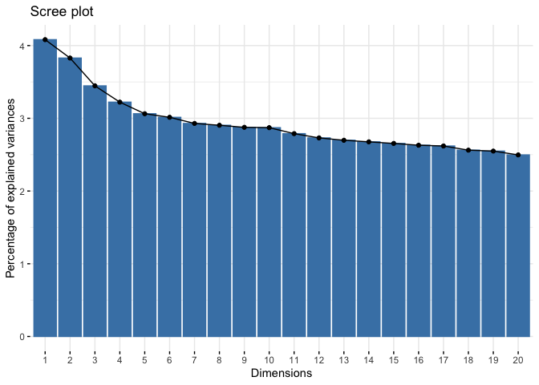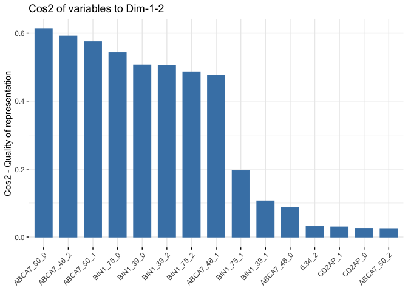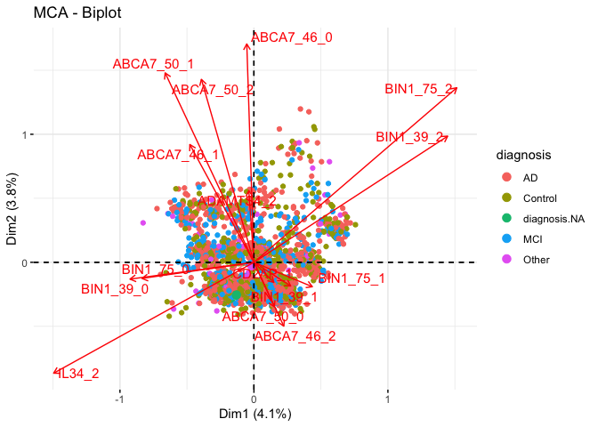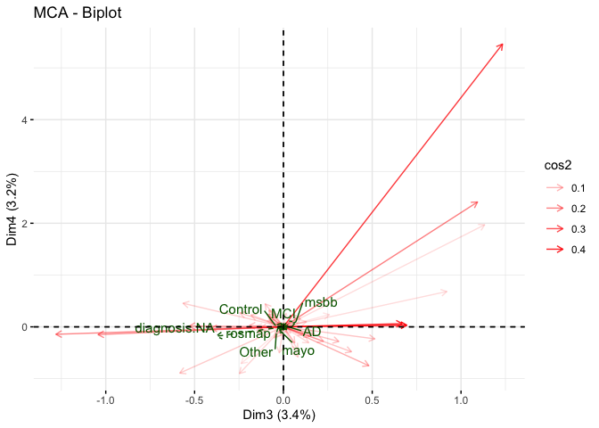
  
### Pooled genotypes

```r
pooled_12 <- c("ADAMTS4_rs4575098", "AP4E1.SPPL2A_rs12595082", "IL34_rs4985556", "SCIMP_rs61481506", "SHARPIN_rs34674752")
pooled_01 <- c("ABCA7_rs3752246", "HLA.DRB1_rs9271192", "PILRA_rs1859788")

ca.df <- data %>%
  mutate_at(pooled_12, 
            function(x) {replace(x, which(x=="1" | x=="2"), "1+2")}) %>%
  mutate_at(pooled_01, 
            function(x) {replace(x, which(x=="0" | x=="1"), "0+1")}) %>%
  column_to_rownames("wgs_id")

colnames(ca.df)[grep("_", colnames(ca.df))] <- varnm


# MCA
res.mca <- MCA(ca.df, graph=FALSE,
               quali.sup=which(colnames(ca.df) %in% c("APOE", "diagnosis", "cohort")))

fviz_eig(res.mca, ncp=20)
fviz_cos2(res.mca, choice = "var", axes = c(1,2), top = 15)
fviz_contrib(res.mca, choice = "var", axes = 2, top = 15)
fviz_contrib(res.mca, choice = "var", axes = 1, top = 15)

fviz_mca_biplot(res.mca, axes = c(1,2),
             label = "var", repel=TRUE,
             habillage = "cohort", # color by cohort 
             select.var = list(contrib = 15),
             arrows = c(FALSE, TRUE),
             ggtheme = theme_minimal(), 
               ) 

fviz_mca_biplot(res.mca, axes = c(3,4),
             label = "var", repel=TRUE,
             habillage = "cohort", # color by cohort 
             select.var = list(contrib = 15),
             arrows = c(FALSE, TRUE),
             ggtheme = theme_minimal(), 
               ) 


fviz_mca_biplot(res.mca, axes = c(1,2),
             label = "var", repel=TRUE,
             habillage = "diagnosis", # color by diagnosis 
             select.var = list(contrib = 15),
             arrows = c(FALSE, TRUE),
             ggtheme = theme_minimal(), 
               ) 

fviz_mca_biplot(res.mca, axes = c(1,2),
             label = c("quali.sup"), repel=TRUE,
             alpha.var = "cos2",
             invisible = c("ind", "ind.sup"),
             arrows = c(FALSE, TRUE),
             ggtheme = theme_minimal(), 
               ) 

fviz_mca_biplot(res.mca, axes = c(3,4),
             label = c("quali.sup"), repel=TRUE,
             alpha.var = "cos2",
             invisible = c("ind", "ind.sup"),
             arrows = c(FALSE, TRUE),
             ggtheme = theme_minimal(), 
               ) 


rm(ca.df)
```

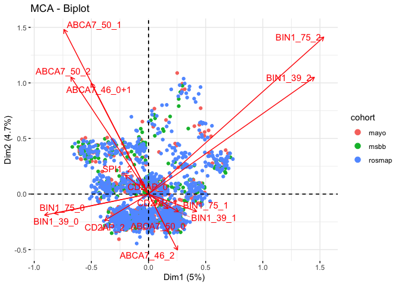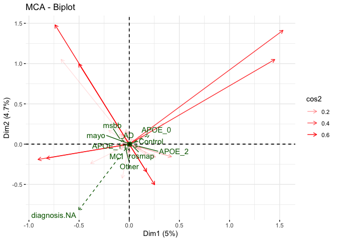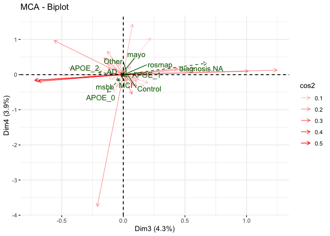
  
## ROSMAP only {.tabset .tabset-fade .tabset-pills}

### All samples

```r
pooled_12 <- c("ADAMTS4_rs4575098", "AP4E1.SPPL2A_rs12595082", "IL34_rs4985556", "SCIMP_rs61481506", "SHARPIN_rs34674752")
pooled_01 <- c("ABCA7_rs3752246", "HLA.DRB1_rs9271192", "PILRA_rs1859788")

ca.df <- data %>%
  mutate_at(pooled_12, 
            function(x) {replace(x, which(x=="1" | x=="2"), "1+2")}) %>%
  mutate_at(pooled_01, 
            function(x) {replace(x, which(x=="0" | x=="1"), "0+1")}) %>%
  column_to_rownames("wgs_id") %>%
  filter(cohort=="rosmap") %>%
  select(-cohort)

colnames(ca.df)[grep("_", colnames(ca.df))] <- varnm


# MCA
res.mca <- MCA(ca.df, graph=FALSE,
               quali.sup=which(colnames(ca.df) %in% c("APOE", "diagnosis")))

fviz_eig(res.mca, ncp=20)
fviz_cos2(res.mca, choice = "var", axes = c(1,2), top = 15)
fviz_contrib(res.mca, choice = "var", axes = 2, top = 15)
fviz_contrib(res.mca, choice = "var", axes = 1, top = 15)


fviz_mca_biplot(res.mca, axes = c(1,2),
             label = "var", repel=TRUE,
             habillage = "diagnosis", # color by diagnosis 
             select.var = list(contrib = 15),
             arrows = c(FALSE, TRUE),
             ggtheme = theme_minimal(), 
               ) 

fviz_mca_biplot(res.mca, axes = c(3,4),
             label = "var", repel=TRUE,
             habillage = "diagnosis", # color by diagnosis 
             select.var = list(contrib = 15),
             arrows = c(FALSE, TRUE),
             ggtheme = theme_minimal(), 
               ) 

fviz_mca_biplot(res.mca, axes = c(1,2),
             label = c("quali.sup"), repel=TRUE,
             alpha.var = "cos2",
             invisible = c("ind", "ind.sup"),
             arrows = c(FALSE, TRUE),
             ggtheme = theme_minimal(), 
               ) 

fviz_mca_biplot(res.mca, axes = c(3,4),
             label = c("quali.sup"), repel=TRUE,
             alpha.var = "cos2",
             invisible = c("ind", "ind.sup"),
             arrows = c(FALSE, TRUE),
             ggtheme = theme_minimal(), 
               ) 

rm(ca.df)
```

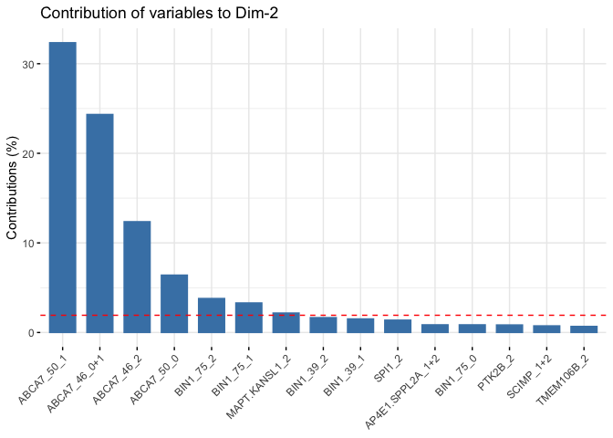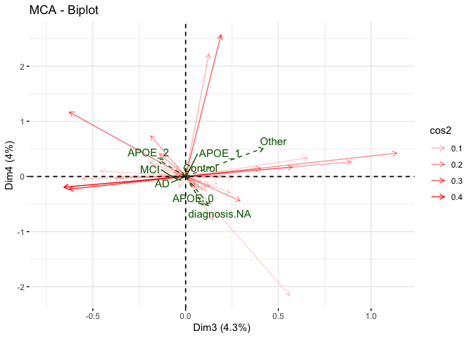
  
  
### AD+MCI samples

```r
pooled_12 <- c("ADAMTS4_rs4575098", "AP4E1.SPPL2A_rs12595082", "IL34_rs4985556", "SCIMP_rs61481506", "SHARPIN_rs34674752")
pooled_01 <- c("ABCA7_rs3752246", "HLA.DRB1_rs9271192", "PILRA_rs1859788")

ca.df <- data %>%
  mutate_at(pooled_12, 
            function(x) {replace(x, which(x=="1" | x=="2"), "1+2")}) %>%
  mutate_at(pooled_01, 
            function(x) {replace(x, which(x=="0" | x=="1"), "0+1")}) %>%
  column_to_rownames("wgs_id") %>%
  filter(cohort=="rosmap") %>%
  select(-cohort)

colnames(ca.df)[grep("_", colnames(ca.df))] <- varnm


# MCA
res.mca <- MCA(ca.df, graph=FALSE,
               quali.sup=which( colnames(ca.df) %in% c("APOE", "diagnosis")),
               ind.sup = which( ! ca.df$diagnosis %in% c("AD", "MCI")))

fviz_eig(res.mca, ncp=20)
fviz_cos2(res.mca, choice = "var", axes = c(1,2), top = 15)
fviz_contrib(res.mca, choice = "var", axes = 2, top = 15)
fviz_contrib(res.mca, choice = "var", axes = 1, top = 15)


fviz_mca_biplot(res.mca, axes = c(1,2),
             label = "var", repel=TRUE,
             habillage = "diagnosis", # color by diagnosis 
             select.var = list(contrib = 15),
             invisible = "ind.sup",
             arrows = c(FALSE, TRUE),
             ggtheme = theme_minimal(), 
               ) 

fviz_mca_biplot(res.mca, axes = c(3,4),
             label = "var", repel=TRUE,
             habillage = "diagnosis", # color by diagnosis 
             select.var = list(contrib = 15),
             invisible = "ind.sup",
             arrows = c(FALSE, TRUE),
             ggtheme = theme_minimal(), 
               ) 

fviz_mca_biplot(res.mca, axes = c(1,2),
             label = c("quali.sup"), repel=TRUE,
             alpha.var = "cos2",
             invisible = c("ind", "ind.sup"),
             arrows = c(FALSE, TRUE),
             ggtheme = theme_minimal(), 
               ) 

fviz_mca_biplot(res.mca, axes = c(3,4),
             label = c("quali.sup"), repel=TRUE,
             alpha.var = "cos2",
             invisible = c("ind", "ind.sup"),
             arrows = c(FALSE, TRUE),
             ggtheme = theme_minimal(), 
               ) 

rm(ca.df)
```

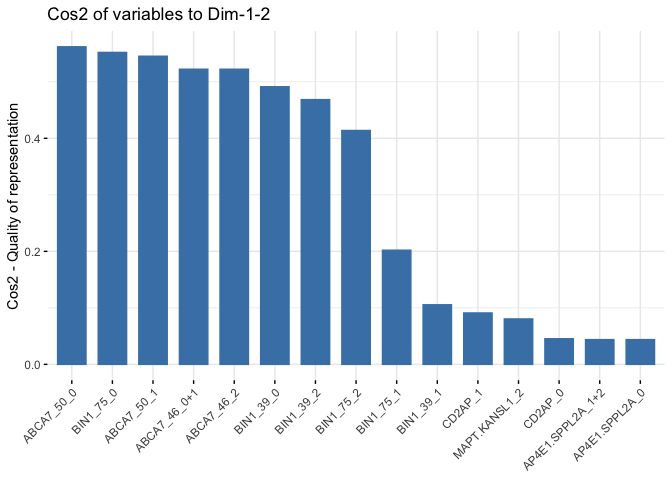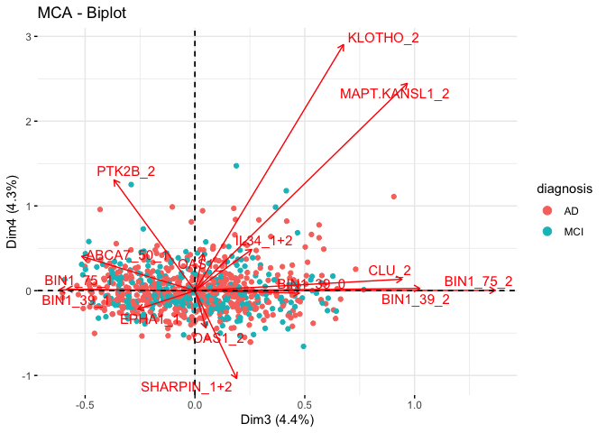
  


# Output
Save objects to local folder:

```r
saveRDS(genotypes, "output/ADvariants_genotypes_all.RDS")
write_csv(genotypes, "output/ADvariants_genotypes_all.csv")
write_csv(apoe, "output/APOE_all.csv")
```

Update output files on Synapse in folder syn23569714:  
The files already exist on Synapse (uploaded manually), therefore here I use dataFileHandleId to specify their synID and tell the function to update them instead of uploading as new.  
Provenance for output files is specified as executed="syn23595214", which is this Rmd file.  
Provenance for the Rmd specifies all the entities that go as input for this analysis (see above) as well as the ADvariants_anno.pbs script used above (uploaded manually).

```r
invisible(synLogin())

file <- File("ADvariants_MCA.Rmd",
             description = "Analysis script",
             parent = "syn23569714",
             dataFileHandleId = "syn23595214")
prov <- Activity(used = c('syn11707420', 'syn11384571', 'syn11384608', 'syn3382527', 'syn3191087'))
file <- synStore(file, activity=prov)

file <- File("output/ADvariants_anno.txt",
             contentType = "text/plain",
             description = "LOAD variant list",
             parent = "syn23569714",
             dataFileHandleId = "syn23569715")
prov <- Activity(executed = "syn23595214")
file <- synStore(file, activity=prov)

file <- File("output/ADvariants_genotypes_all.csv", 
             contentType = "text/csv",
             description = "LOAD variants all genotypes",
             parent = "syn23569714",
             dataFileHandleId = "syn23569716")
prov <- Activity(executed = c("syn23595214", "syn23569719"))
file <- synStore(file, activity=prov)

file <- File("output/APOE_all.csv", 
             contentType = "text/csv",
             description = "APOE all genotypes",
             parent = "syn23569714",
             dataFileHandleId = "syn23569717")
prov <- Activity(executed = c("syn23595214", "syn23569719"))
file <- synStore(file, activity=prov)
```

# Session info

```r
devtools::session_info()
```

```
## ─ Session info ───────────────────────────────────────────────────────────────
##  setting  value                       
##  version  R version 3.6.2 (2019-12-12)
##  os       macOS Mojave 10.14.6        
##  system   x86_64, darwin15.6.0        
##  ui       X11                         
##  language (EN)                        
##  collate  en_US.UTF-8                 
##  ctype    en_US.UTF-8                 
##  tz       America/New_York            
##  date     2020-12-04                  
## 
## ─ Packages ───────────────────────────────────────────────────────────────────
##  package        * version  date       lib source        
##  assertthat       0.2.1    2019-03-21 [1] CRAN (R 3.6.0)
##  backports        1.1.8    2020-06-17 [1] CRAN (R 3.6.2)
##  blob             1.2.1    2020-01-20 [1] CRAN (R 3.6.0)
##  broom            0.7.0    2020-07-09 [1] CRAN (R 3.6.2)
##  callr            3.4.3    2020-03-28 [1] CRAN (R 3.6.2)
##  cellranger       1.1.0    2016-07-27 [1] CRAN (R 3.6.0)
##  cli              2.0.2    2020-02-28 [1] CRAN (R 3.6.0)
##  cluster          2.1.0    2019-06-19 [1] CRAN (R 3.6.2)
##  codetools        0.2-16   2018-12-24 [1] CRAN (R 3.6.2)
##  colorspace       1.4-1    2019-03-18 [1] CRAN (R 3.6.0)
##  crayon           1.3.4    2017-09-16 [1] CRAN (R 3.6.0)
##  data.table     * 1.13.0   2020-07-24 [1] CRAN (R 3.6.2)
##  DBI              1.1.0    2019-12-15 [1] CRAN (R 3.6.0)
##  dbplyr           1.4.4    2020-05-27 [1] CRAN (R 3.6.2)
##  desc             1.2.0    2018-05-01 [1] CRAN (R 3.6.0)
##  devtools         2.3.1    2020-07-21 [1] CRAN (R 3.6.2)
##  digest           0.6.25   2020-02-23 [1] CRAN (R 3.6.0)
##  dplyr          * 1.0.1    2020-07-31 [1] CRAN (R 3.6.2)
##  ellipsis         0.3.1    2020-05-15 [1] CRAN (R 3.6.2)
##  evaluate         0.14     2019-05-28 [1] CRAN (R 3.6.0)
##  factoextra     * 1.0.7    2020-04-01 [1] CRAN (R 3.6.2)
##  FactoMineR     * 2.3      2020-02-29 [1] CRAN (R 3.6.0)
##  fansi            0.4.1    2020-01-08 [1] CRAN (R 3.6.0)
##  flashClust       1.01-2   2012-08-21 [1] CRAN (R 3.6.0)
##  forcats        * 0.5.0    2020-03-01 [1] CRAN (R 3.6.0)
##  fs               1.5.0    2020-07-31 [1] CRAN (R 3.6.2)
##  generics         0.0.2    2018-11-29 [1] CRAN (R 3.6.0)
##  ggplot2        * 3.3.2    2020-06-19 [1] CRAN (R 3.6.2)
##  ggrepel          0.8.2    2020-03-08 [1] CRAN (R 3.6.0)
##  glue             1.4.1    2020-05-13 [1] CRAN (R 3.6.2)
##  gtable           0.3.0    2019-03-25 [1] CRAN (R 3.6.0)
##  haven            2.3.1    2020-06-01 [1] CRAN (R 3.6.2)
##  hms              0.5.3    2020-01-08 [1] CRAN (R 3.6.0)
##  htmltools        0.5.0    2020-06-16 [1] CRAN (R 3.6.2)
##  httr             1.4.2    2020-07-20 [1] CRAN (R 3.6.2)
##  jsonlite         1.7.0    2020-06-25 [1] CRAN (R 3.6.2)
##  knitr            1.29     2020-06-23 [1] CRAN (R 3.6.2)
##  lattice        * 0.20-41  2020-04-02 [1] CRAN (R 3.6.2)
##  leaps            3.1      2020-01-16 [1] CRAN (R 3.6.0)
##  lifecycle        0.2.0    2020-03-06 [1] CRAN (R 3.6.0)
##  lmtest           0.9-37   2019-04-30 [1] CRAN (R 3.6.0)
##  lubridate        1.7.9    2020-06-08 [1] CRAN (R 3.6.2)
##  magrittr         1.5      2014-11-22 [1] CRAN (R 3.6.0)
##  MASS             7.3-51.6 2020-04-26 [1] CRAN (R 3.6.2)
##  memoise          1.1.0    2017-04-21 [1] CRAN (R 3.6.0)
##  modelr           0.1.8    2020-05-19 [1] CRAN (R 3.6.2)
##  munsell          0.5.0    2018-06-12 [1] CRAN (R 3.6.0)
##  pack             0.1-1    2019-04-26 [1] local         
##  pillar           1.4.6    2020-07-10 [1] CRAN (R 3.6.2)
##  pins           * 0.4.3    2020-07-10 [1] CRAN (R 3.6.2)
##  pkgbuild         1.1.0    2020-07-13 [1] CRAN (R 3.6.2)
##  pkgconfig        2.0.3    2019-09-22 [1] CRAN (R 3.6.0)
##  pkgload          1.1.0    2020-05-29 [1] CRAN (R 3.6.2)
##  prettyunits      1.1.1    2020-01-24 [1] CRAN (R 3.6.0)
##  processx         3.4.3    2020-07-05 [1] CRAN (R 3.6.2)
##  ps               1.3.3    2020-05-08 [1] CRAN (R 3.6.2)
##  purrr          * 0.3.4    2020-04-17 [1] CRAN (R 3.6.2)
##  PythonEmbedInR   0.5.73   2020-09-16 [1] local         
##  R6               2.4.1    2019-11-12 [1] CRAN (R 3.6.0)
##  Rcpp             1.0.5    2020-07-06 [1] CRAN (R 3.6.2)
##  readr          * 1.3.1    2018-12-21 [1] CRAN (R 3.6.0)
##  readxl           1.3.1    2019-03-13 [1] CRAN (R 3.6.0)
##  remotes          2.2.0    2020-07-21 [1] CRAN (R 3.6.2)
##  reprex           0.3.0    2019-05-16 [1] CRAN (R 3.6.0)
##  rlang            0.4.7    2020-07-09 [1] CRAN (R 3.6.2)
##  rmarkdown        2.3      2020-06-18 [1] CRAN (R 3.6.2)
##  rprojroot        1.3-2    2018-01-03 [1] CRAN (R 3.6.0)
##  rstudioapi       0.11     2020-02-07 [1] CRAN (R 3.6.0)
##  rvest            0.3.6    2020-07-25 [1] CRAN (R 3.6.2)
##  scales           1.1.1    2020-05-11 [1] CRAN (R 3.6.2)
##  scatterplot3d    0.3-41   2018-03-14 [1] CRAN (R 3.6.0)
##  sessioninfo      1.1.1    2018-11-05 [1] CRAN (R 3.6.0)
##  stringi          1.4.6    2020-02-17 [1] CRAN (R 3.6.0)
##  stringr        * 1.4.0    2019-02-10 [1] CRAN (R 3.6.0)
##  synapser       * 0.8.71   2020-09-16 [1] local         
##  testthat         2.3.2    2020-03-02 [1] CRAN (R 3.6.0)
##  tibble         * 3.0.3    2020-07-10 [1] CRAN (R 3.6.2)
##  tidyr          * 1.1.1    2020-07-31 [1] CRAN (R 3.6.2)
##  tidyselect       1.1.0    2020-05-11 [1] CRAN (R 3.6.2)
##  tidyverse      * 1.3.0    2019-11-21 [1] CRAN (R 3.6.0)
##  usethis          1.6.1    2020-04-29 [1] CRAN (R 3.6.2)
##  vcd            * 1.4-7    2020-04-02 [1] CRAN (R 3.6.2)
##  vctrs            0.3.2    2020-07-15 [1] CRAN (R 3.6.2)
##  withr            2.2.0    2020-04-20 [1] CRAN (R 3.6.2)
##  xfun             0.16     2020-07-24 [1] CRAN (R 3.6.2)
##  xml2             1.3.2    2020-04-23 [1] CRAN (R 3.6.2)
##  yaml             2.2.1    2020-02-01 [1] CRAN (R 3.6.0)
##  zoo              1.8-8    2020-05-02 [1] CRAN (R 3.6.2)
## 
## [1] /Library/Frameworks/R.framework/Versions/3.6/Resources/library
```
